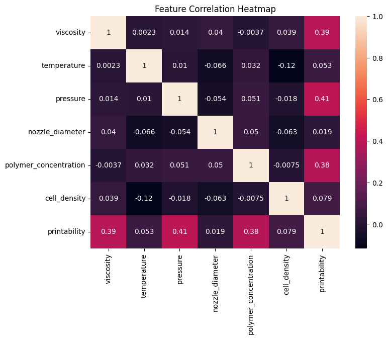
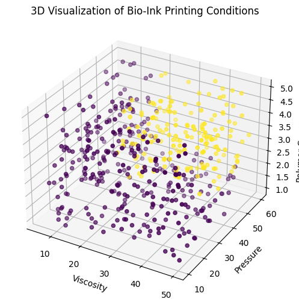
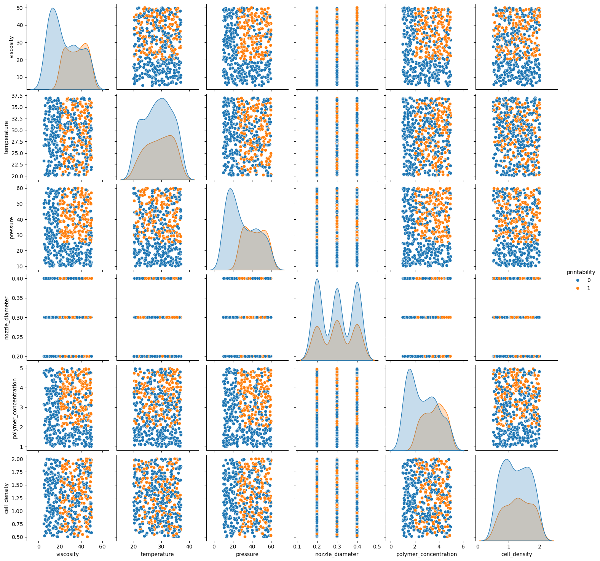
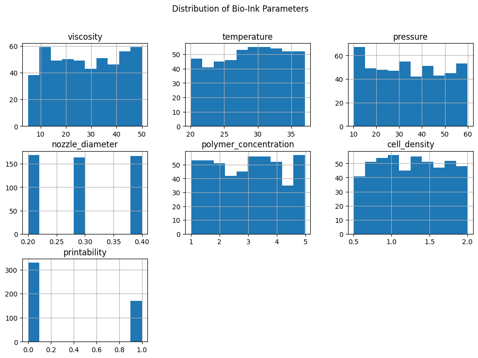

# 🧬 AI Bio-Ink Printability Predictor for 3D Bioprinting

## 📌 Project Overview

This project develops a **Machine Learning based system** to predict whether a **bio-ink formulation is printable** in a **3D bioprinting process**.
The prediction is based on key printing parameters such as **viscosity, temperature, pressure, nozzle diameter, polymer concentration, and cell density**.

The project integrates:

* 📊 Exploratory Data Analysis (EDA)
* 🤖 Machine Learning Model (Random Forest)
* 📈 Data Visualization
* 🌐 Interactive Web Application using **Streamlit**

This system helps simulate and analyze **optimal conditions for bio-ink printing**, which is an important aspect of **bioprinting research and tissue engineering**.

---

# 🧪 Parameters Used

| Parameter             | Description                        |
| --------------------- | ---------------------------------- |
| Viscosity             | Thickness of the bio-ink           |
| Temperature           | Printing temperature               |
| Pressure              | Extrusion pressure                 |
| Nozzle Diameter       | Diameter of printer nozzle         |
| Polymer Concentration | Amount of polymer in bio-ink       |
| Cell Density          | Density of biological cells in ink |

---

# 🧠 Machine Learning Workflow

```
Dataset Generation
        ↓
Exploratory Data Analysis
        ↓
Feature Visualization
        ↓
Model Training (Random Forest)
        ↓
Model Evaluation
        ↓
Interactive Streamlit Application
```

---

# 📊 Data Visualization

## Correlation Heatmap



The heatmap shows relationships between bio-ink parameters and printability.

---

## 3D Visualization of Printing Parameters



This visualization demonstrates how **viscosity, pressure, and polymer concentration** interact to influence printability.

---

## Pair Plot of Bio-Ink Features



Pairplots help analyze relationships and distributions among all features used in the model.

---

## Bio-Ink Dataset Visualization



This visualization highlights the distribution and behaviour of bio-ink parameters used in the dataset.

---

# 🤖 Model Used

**Random Forest Classifier**

Reasons for choosing this model:

* Handles nonlinear relationships well
* Works effectively with tabular data
* Provides feature importance insights
* Robust to noise and overfitting

---

# 🌐 Interactive Prediction Interface

The project includes a **Streamlit-based UI** where users can input bio-ink parameters and instantly predict whether the formulation is printable.

### Example Input

* Viscosity: 30
* Temperature: 25
* Pressure: 40
* Nozzle Diameter: 0.4
* Polymer Concentration: 3
* Cell Density: 1.2

### Output

```
Printable Bio-Ink
```

---

# 🛠 Technologies Used

* Python
* Pandas
* NumPy
* Scikit-Learn
* Matplotlib
* Seaborn
* Streamlit
* Joblib

---

# 📂 Project Structure

```
bioink-ai-project
│
├── dataset
│   └── bioink_dataset.csv
│
├── model
│   └── bioink_model.pkl
│
├── notebook
│   └── bioink_training.ipynb
│
├── ui
│   └── app.py
│
├── images
│   ├── heatmap.png
│   ├── 3d_plot.png
│   ├── pairplot.png
│   └── bioink.png
│
├── requirements.txt
└── README.md
```

---

# ▶️ Running the Project

### 1 Install dependencies

```
pip install -r requirements.txt
```

### 2 Run the Streamlit application

```
streamlit run ui/app.py
```

---

# 🚀 Future Improvements

* Use **real experimental bioprinting datasets**
* Apply **deep learning models**
* Optimize **bio-ink formulation automatically**
* Deploy the system as an **online web application**

---

# 👩‍💻 Author

**Rishika Kumari**

AI & Machine Learning Project
Bio-Ink Printability Prediction using Machine Learning
